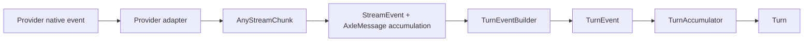
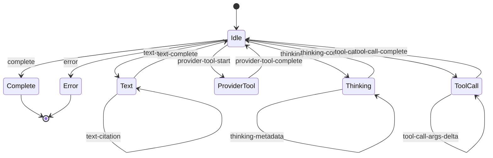

# Provider Stream Format Map

This is a working reference for how provider-native streaming events move
through Axle's intermediate formats:

```txt
provider stream event
  -> AnyStreamChunk
  -> StreamEvent + AxleMessage accumulation
  -> TurnEvent
  -> Turn
```

The goal is to make each adapter mapping inspectable without jumping across
`createStreamingAdapter.ts`, `providers/stream.ts`, `turns/eventBuilder.ts`, and
`turns/accumulator.ts`.

## Pipeline



## Normalized Stream Lifecycle

This is the conceptual lifecycle for Axle-normalized stream chunks. It is not a
strict implementation automaton: provider adapters can buffer native events,
emit multiple chunks for one provider event, or skip provider events entirely.



## Columns

| Column | Meaning |
| --- | --- |
| Provider event | Native event or chunk from the provider SDK. |
| Axle stream chunk | Adapter output from `createStreamingAdapter()`. This is the provider-normalized stream primitive. |
| Stream event | Public stream event emitted by `stream()`. |
| AxleMessage effect | How the final assistant `AxleMessage.content` changes. |
| Turn event | Presentation event emitted by `TurnEventBuilder`. |
| Turn effect | How `TurnAccumulator` changes renderable turn state. |
| Notes | Important ordering, indexing, or provider-specific caveats. |

## OpenAI Responses API

| Provider event | Axle stream chunk | Stream event | AxleMessage effect | Turn event | Turn effect | Notes |
| --- | --- | --- | --- | --- | --- | --- |
| `response.created` | - `start` with `{ id, model, timestamp }` | - `turn:start` with `{ id, model }` | - no content mutation<br>- captures provider message id/model for final assistant message | - no event from `TurnEventBuilder`<br>- agent turn is already started by `startAgentTurn()` | - no direct change from this stream event | - stream turn id becomes `AxleAssistantMessage.id`<br>- presentation turn id is generated separately |
| `response.output_item.added` / reasoning item | - `thinking-start` with `{ index, id?, continuity? }` | - `thinking:start` with `{ index, continuity? }` | - creates `ContentPartThinking`<br>- initializes `text: ""`<br>- stores OpenAI encrypted continuity when present | - `part:start` with `ThinkingPart` | - adds a stable thinking part<br>- stores continuity for later rendering/continuation | - `currentPartIndex` is shared with following reasoning text/summary deltas |
| `response.output_text.delta` | - first delta for a text item emits `text-start` with `{ index }`<br>- then emits `text-delta` with `{ index, text: event.delta }`<br>- later deltas only emit `text-delta` | - `text:start` for the first delta<br>- then `text:delta` with `{ index, delta, accumulated }` | - creates or updates a `ContentPartText` at the current part index<br>- shape: `{ type: "text", text }`<br>- final `AxleAssistantMessage.content` contains that text part | - `part:start` with a `TextPart`<br>- then `text:delta` for each delta | - adds a stable text part to the current turn<br>- mutates `part.text` as deltas arrive | - OpenAI text part identity is keyed by `item_id + content_index` inside the adapter<br>- Axle converts that to a numeric stream part index<br>- `TurnEventBuilder` converts that to a Turn part id |
| `response.output_text.annotation.added` | - `text-citation` with `{ index, citation }` | - `text:citation` with `{ index, citation, citations }` | - appends `Citation` to the target `ContentPartText.citations` | - `text:citation` with `{ partId, citation }` | - appends citation to the target `TextPart.citations` | - citation is normalized from OpenAI annotation types: `url_citation`, `file_citation`, `container_file_citation`, `file_path` |
| `response.output_text.done` | - `text-complete` with `{ index }` | - `text:end` with `{ index, final }` | - closes the current text part<br>- no content change beyond final accumulated text | - `part:end` for the active text part | - updates text part timing<br>- clears current text part | - adapter resets `currentPartIndex` |
| `response.reasoning_text.delta` | - `thinking-delta` with `{ index, text }` | - `thinking:delta` with `{ index, delta, accumulated }` | - appends to `ContentPartThinking.text` | - `thinking:delta` with `{ partId, delta }` | - appends to `ThinkingPart.text` | - only emitted when OpenAI exposes renderable reasoning text |
| `response.reasoning_summary_text.delta` | - `thinking-summary-delta` with `{ index, text }` | - `thinking:summary-delta` with `{ index, delta, accumulated }` | - appends to `ContentPartThinking.summary` | - `thinking:summary-delta` with `{ partId, delta }` | - appends to `ThinkingPart.summary` | - summary is renderable; encrypted continuity is separate |
| `response.output_item.done` / reasoning item | - `thinking-complete` with `{ index }` | - `thinking:end` with `{ index, final }` | - closes current thinking part | - `part:end` for active thinking part | - updates thinking part timing<br>- clears current thinking part | - adapter resets `currentPartIndex` |
| `response.output_item.added` / function call | - no chunk | - no stream event | - no content change yet | - no turn event | - no turn change | - adapter stores `{ name, callId }` so later argument deltas can create the tool-call part |
| `response.function_call_arguments.delta` | - first delta emits `tool-call-start` with `{ index, id, name }`<br>- then emits `tool-call-args-delta` with `{ index, id, name, delta, accumulated }` | - `tool:request` for first delta<br>- then `tool:args-delta` | - creates `ContentPartToolCall` with empty `parameters`<br>- argument deltas do not mutate final parameters yet | - `part:start` with pending `ToolAction`<br>- then `action:args-delta` | - adds a pending tool action<br>- stores streamed args as `detail.pendingArgs` | - OpenAI function metadata may arrive before args via `response.output_item.added` |
| `response.function_call_arguments.done` | - `tool-call-complete` with parsed `arguments` | - no public stream event | - updates the current `ContentPartToolCall.parameters` | - no immediate turn event | - no immediate turn change | - tool action becomes running/complete later during Axle tool execution events |
| `response.output_item.added` / provider tool item | - `provider-tool-start` with `{ index, id, name }` | - `provider-tool:start` | - creates `ContentPartProviderTool` with `{ id, name }` | - `part:start` with `ProviderToolAction`<br>- `action:running` | - adds a running provider-tool action | - currently recognized OpenAI provider tools: `web_search_call`, `file_search_call`, `code_interpreter_call` |
| `response.output_item.done` / provider tool item | - `provider-tool-complete` with `{ index, id, name, output }` | - `provider-tool:complete` | - sets `ContentPartProviderTool.output` | - `action:complete` with success result | - marks provider-tool action complete<br>- stores `detail.result.content` | - `response.web_search_call.*` progress events are ignored; completion uses the output item |
| `response.completed` | - `complete` with `{ finishReason, usage }` | - `turn:complete` with `{ message, usage }` after stream loop builds final assistant message | - finalizes `AxleAssistantMessage` with all accumulated parts<br>- sets `finishReason`, `usage`, `model`, `id` | - `turn:complete` only updates accumulated usage<br>- later `finalizeTurn()` emits `turn:end` | - marks agent turn complete at finalize<br>- stores final usage/timing | - `finishReason` becomes `function_call` if any function call completed |
| `response.failed` | - `error` with provider error payload | - `error` result path | - no final assistant message | - `error` | - accumulator handles the error event but does not mutate a specific part | - stream returns model error |
| `response.in_progress`, content/reasoning part added/done, `response.web_search_call.*` | - no chunk | - no stream event | - no content change | - no turn event | - no turn change | - intentionally ignored by adapter today |

## Anthropic Messages API

| Provider event | Axle stream chunk | Stream event | AxleMessage effect | Turn event | Turn effect | Notes |
| --- | --- | --- | --- | --- | --- | --- |
| `message_start` | - `start` with `{ id, model, timestamp }` | - `turn:start` with `{ id, model }` | - no content mutation<br>- captures provider message id/model | - no event from `TurnEventBuilder` | - no direct change | - input/cache token counts are initialized here |
| `content_block_start` / `text` | - `text-start` with `{ index }` | - `text:start` | - creates empty `ContentPartText` | - `part:start` with `TextPart` | - adds stable text part | - Anthropic block index is reused as stream chunk index |
| `content_block_delta` / `text_delta` | - `text-delta` with `{ index, text }` | - `text:delta` with `{ index, delta, accumulated }` | - appends to `ContentPartText.text` | - `text:delta` | - appends to `TextPart.text` | -  |
| `content_block_delta` / `citations_delta` | - `text-citation` with `{ index, citation }` | - `text:citation` | - appends normalized `Citation` to `ContentPartText.citations` | - `text:citation` | - appends to `TextPart.citations` | - citation source can be document, web, or search-result depending on Anthropic payload |
| `content_block_stop` / text block | - `text-complete` with `{ index }` | - `text:end` | - closes text part | - `part:end` | - updates text timing | - block type is tracked from `content_block_start` |
| `content_block_start` / `thinking` | - `thinking-start` with `{ index, redacted, continuity.signature }` | - `thinking:start` | - creates `ContentPartThinking`<br>- stores Anthropic signature continuity | - `part:start` with `ThinkingPart` | - adds thinking part with continuity | - empty thinking plus signature is treated as redacted |
| `content_block_delta` / `thinking_delta` | - `thinking-delta` with `{ index, text }` | - `thinking:delta` | - appends to `ContentPartThinking.text` | - `thinking:delta` | - appends to `ThinkingPart.text` | - renderable extended thinking |
| `content_block_delta` / `signature_delta` | - `thinking-metadata` with `{ index, continuity.signature }` | - `thinking:update` | - updates `ContentPartThinking.continuity` | - `thinking:update` | - updates `ThinkingPart.continuity` | - signature is continuation state, not render text |
| `content_block_start` / `redacted_thinking` | - `thinking-start` with `{ index, redacted: true, continuity.redactedData }` | - `thinking:start` | - creates redacted `ContentPartThinking` | - `part:start` with redacted `ThinkingPart` | - adds redacted thinking part | - redacted payload is continuation state |
| `content_block_stop` / thinking block | - `thinking-complete` with `{ index }` | - `thinking:end` | - closes thinking part | - `part:end` | - updates thinking timing | - applies to both thinking and redacted thinking block types |
| `content_block_start` / `tool_use` | - `tool-call-start` with `{ index, id, name }` | - `tool:request` | - creates `ContentPartToolCall` with empty `parameters` | - `part:start` with pending `ToolAction` | - adds pending tool action | - input JSON arrives separately via `input_json_delta` |
| `content_block_delta` / `input_json_delta` | - `tool-call-args-delta` with `{ index, id, name, delta, accumulated }` | - `tool:args-delta` | - does not mutate final parameters yet | - `action:args-delta` | - updates `detail.pendingArgs` | - adapter buffers partial JSON by block index |
| `content_block_stop` / tool block | - `tool-call-complete` with parsed `arguments` | - no public stream event | - updates `ContentPartToolCall.parameters` | - no immediate turn event | - no immediate turn change | - action moves to running/complete later during Axle tool execution |
| `content_block_start` / `server_tool_use` | - `provider-tool-start` with `{ index, id, name }` | - `provider-tool:start` | - creates `ContentPartProviderTool` | - `part:start` with `ProviderToolAction`<br>- `action:running` | - adds running provider-tool action | - maps server tool id to provider-tool part |
| `content_block_start` / `web_search_tool_result` | - `provider-tool-complete` with `{ index, id, name, output }` | - `provider-tool:complete` | - sets `ContentPartProviderTool.output` | - `action:complete` | - marks provider-tool action complete | - output is linked back to prior `server_tool_use` by `tool_use_id` |
| `content_block_stop` / provider-tool block | - no chunk | - no stream event | - no extra mutation | - no turn event | - no turn change | - completion already happened when `web_search_tool_result` started |
| `message_delta` with usage only | - no chunk | - no stream event | - no content mutation | - no turn event | - no turn change | - adapter updates token counters |
| `message_delta` with `stop_reason` | - `complete` with `{ finishReason, usage }` | - `turn:complete` after final assistant message is built | - finalizes `AxleAssistantMessage` with accumulated parts | - `turn:complete` updates accumulated usage<br>- later `turn:end` from `finalizeTurn()` | - marks turn complete at finalize | - cache read/write tokens are preserved in usage |
| `message_stop` | - no chunk | - no stream event | - no content mutation | - no turn event | - no turn change | - adapter intentionally takes no action |

## Gemini

| Provider event | Axle stream chunk | Stream event | AxleMessage effect | Turn event | Turn effect | Notes |
| --- | --- | --- | --- | --- | --- | --- |
| first streamed `GenerateContentResponse` | - `start` with `{ id, model, timestamp }` | - `turn:start` | - no content mutation<br>- captures response id/model | - no event from `TurnEventBuilder` | - no direct change | - id falls back to `gemini-${Date.now()}` |
| streamed `usageMetadata` | - no immediate chunk | - no stream event | - no content mutation | - no turn event | - no turn change | - adapter stores input/output/cache/reasoning token counts for final `complete` |
| candidate content part with `text` and `thought: true` | - opens thinking if needed via `thinking-start`<br>- emits `thinking-summary-delta` with `{ index, text }` | - `thinking:start` if needed<br>- `thinking:summary-delta` | - creates/updates `ContentPartThinking.summary`<br>- stores Gemini continuity if `thoughtSignature` is present | - `part:start` if needed<br>- `thinking:summary-delta` | - adds thinking part<br>- appends to `ThinkingPart.summary` | - Gemini thought text is treated as summary, not raw `text` |
| candidate content part with signature only | - no chunk | - no stream event | - no content mutation | - no turn event | - no turn change | - skipped today because there is no open renderable part to attach it to |
| candidate content part with normal `text` | - opens text if needed via `text-start`<br>- emits `text-delta` with `{ index, text }` | - `text:start` if needed<br>- `text:delta` | - creates/updates `ContentPartText.text` | - `part:start` if needed<br>- `text:delta` | - adds text part<br>- appends to `TextPart.text` | - model part index is mapped to stream part index for later grounding citations |
| candidate `groundingMetadata` / `citationMetadata` | - `text-citation` with `{ index, citation }` | - `text:citation` | - appends normalized citation to target `ContentPartText.citations` | - `text:citation` | - appends to `TextPart.citations` | - citation is skipped if no text stream part can be mapped |
| candidate function call part | - closes active text/thinking part<br>- emits `tool-call-start`<br>- emits synthetic full `tool-call-args-delta`<br>- emits `tool-call-complete` | - `text:end` or `thinking:end` if needed<br>- `tool:request`<br>- `tool:args-delta` | - creates `ContentPartToolCall`<br>- then sets final `parameters` immediately | - `part:start` with pending `ToolAction`<br>- `action:args-delta` | - adds pending tool action<br>- stores full JSON args as pending args | - Gemini buffers function args; Axle synthesizes one delta for cross-provider consistency |
| candidate `finishReason` success | - closes active part<br>- emits `complete` with `{ finishReason, usage }` | - `text:end` / `thinking:end` if needed<br>- `turn:complete` after final assistant message is built | - finalizes `AxleAssistantMessage` with accumulated parts | - `part:end` if needed<br>- `turn:complete`, then `turn:end` at finalize | - marks turn complete at finalize | - if function calls were present, finish reason becomes `function_call` |
| candidate `finishReason` error | - closes active part<br>- emits `error` with `FinishReasonError` | - `error` result path | - no final assistant message | - `error` | - accumulator handles error event without part mutation | - only used when stop reason is unsupported and no function call is pending |
| unrecognized non-function part | - no chunk | - no stream event | - no content mutation | - no turn event | - no turn change | - adapter logs the unhandled part keys |

## Chat Completions-Compatible APIs

| Provider event | Axle stream chunk | Stream event | AxleMessage effect | Turn event | Turn effect | Notes |
| --- | --- | --- | --- | --- | --- | --- |
| first chunk with a choice | - `start` with `{ id, model, timestamp }` | - `turn:start` | - no content mutation<br>- captures chat completion id/model | - no event from `TurnEventBuilder` | - no direct change | - usage-only chunks without choices do not start the turn |
| chunk with `usage` | - no immediate chunk | - no stream event | - no content mutation | - no turn event | - no turn change | - adapter stores latest usage for `finalize()` |
| chunk with `delta.reasoning_content` or `delta.reasoning` | - opens thinking if needed via `thinking-start`<br>- emits `thinking-delta` with `{ index, text }` | - `thinking:start` if needed<br>- `thinking:delta` | - creates/updates `ContentPartThinking.text` | - `part:start` if needed<br>- `thinking:delta` | - adds thinking part<br>- appends to `ThinkingPart.text` | - used by OpenRouter/DeepSeek/vLLM/Kimi-style fields |
| chunk with `delta.content` | - opens text if needed via `text-start`<br>- emits `text-delta` with `{ index, text }` | - `text:start` if needed<br>- `text:delta` | - creates/updates `ContentPartText.text` | - `part:start` if needed<br>- `text:delta` | - adds text part<br>- appends to `TextPart.text` | - switches from thinking to text by closing the active thinking part first |
| chunk with `delta.tool_calls` | - closes active text/thinking part<br>- first delta for each tool emits `tool-call-start`<br>- argument deltas emit `tool-call-args-delta` | - `text:end` or `thinking:end` if needed<br>- `tool:request`<br>- `tool:args-delta` | - creates `ContentPartToolCall` with empty parameters<br>- argument deltas are buffered until finish | - `part:start` with pending `ToolAction`<br>- `action:args-delta` | - adds pending tool action<br>- stores streamed args as `detail.pendingArgs` | - buffer is keyed by provider tool-call index |
| chunk with `finish_reason` | - closes active part<br>- flushes each buffered tool as `tool-call-complete`<br>- defers `complete` until `finalize()` | - `text:end` / `thinking:end` if needed<br>- no immediate completion event for `tool-call-complete` | - sets final `ContentPartToolCall.parameters` for buffered tools<br>- remembers finish reason | - `part:end` if needed<br>- no immediate tool completion turn event | - closes active text/thinking timing | - deferral lets usage-only final chunks arrive before `complete` |
| adapter `finalize()` after stream ends | - `complete` with `{ finishReason, usage }` | - `turn:complete` after final assistant message is built | - finalizes `AxleAssistantMessage` | - `turn:complete`, then `turn:end` at finalize | - marks turn complete at finalize | - emits nothing if no finish reason was seen |
